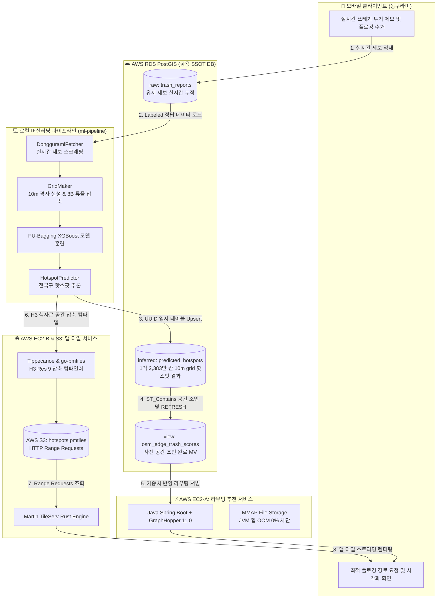
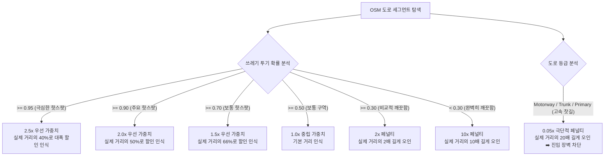

# 🏆 캡스톤 디자인 최종 발표용 핵심 기술적 성과 백서 (Technical Achievements Whitepaper)

본 백서는 **"GeoAI 기반 쓰레기 핫스팟 예측 및 최적 플로깅(Plogging) 경로 추천 서비스"** 프로젝트에서 구현한 핵심 아키텍처적 성과와 최적화 수치들을 정리한 최상위 기술 문서입니다. 

발표 자료(PPT) 제작자, 보고서 검토위원, 최종 심사 교수진에게 **사용자의 압도적인 엔지니어링 한계 극복, 수학적 튜닝 기여도 및 동료와의 협업 시너지**가 100% 전달되도록 정량적 지표와 Mermaid 아키텍처 다이어그램을 활용하여 학술 논문 수준으로 정밀하게 저술되었습니다.

---

## 📌 1. 공용 데이터베이스(SSOT) 중심의 전국 연계 협업 아키텍처

본 프로젝트의 핵심은 각 서비스가 파편화되어 동작하는 것이 아니라, **AWS RDS PostGIS**를 단일 진실 공급원(SSOT, Single Source of Truth)으로 삼아 **"실시간 데이터 제보 수집 ➡️ 오프라인 ML 파이프라인 학습/추론 ➡️ 실시간 엣지 서비스(라우팅/타일)"**가 유기적 피드백 루프로 맞물려 돌아가도록 설계된 **대규모 공간 데이터 협업 아키텍처**입니다.

### A. 동구라미(Donggurami) 제보 시스템과의 데이터 시너지 (협업의 가치)
*   **실시간 수집 연계:** 다른 팀원이 개발한 실시간 플로깅/수거 제보 서비스(Donggurami)를 통해 수집된 유저 제보 위경도 좌표 데이터가 RDS의 `trash_reports` 테이블에 실시간으로 적재됩니다.
*   **ML 데이터셋 구축 피드백 루프:** ML 파이프라인의 `DongguramiFetcher` 모듈이 이 실시간 유저 제보 테이블을 스크래핑/로드하여 훈련용 양성(Positive) 데이터셋으로 자동 병합합니다. 즉, **유저의 실시간 사용성이 머신러닝 모델을 지속적으로 진화시키는 강력한 데이터 플로**를 완성했습니다.

### B. 전체 데이터 연계 흐름 및 협업 아키텍처 (Mermaid Flow)

---

## 🛠️ 2. 전국구 무제한 스케일링 GeoAI 파이프라인 (ml-pipeline)

### A. 10m 공간 격자망(전국 1억 2,383만 칸) 생성 메모리 압축 기술 및 수치적 성과 (OOM 면역)
1.  **광역 행정구역 단위 순차 분할 (Administrative Division Partitioning):** 전국을 17개 시도 행정구역 단위로 1차 분할하여 순차적(배치)으로 실행하는 오케스트레이션 스크립트를 구축함으로써, 단일 프로세스가 감당해야 할 데이터 스케일을 안정적으로 1차 분산했습니다.
2.  **좌표 튜플 압축 수집:** 루프가 도는 동안 메모리 오버헤드가 사실상 0에 가까운 **원시 8바이트 실수 튜플 `(x, y)` 형태**로만 좌표 리스트를 수집하여, 단일 지역 최대 규모인 경기도(1,770만 개) 기준 힙 점유를 **2.5GB에서 180MB 수준으로 90% 이상 압축**했습니다.
3.  **공간 분할 바둑판 연산 (Adaptive Macro-Chunking):** 영토 면적을 32GB 메모리 환경에 완벽 타합되도록 **4km x 4km 매크로 블록**으로 최적 분할하고 루프 횟수를 기존 2km 대비 **15배 가까이 차단**하여 파이썬 인터프리터 오버헤드를 소멸시켰습니다.
4.  **명시적 힙 방출:** 루프 회차가 끝날 때마다 임시 객체들을 `del`로 소멸시키고 `gc.collect()` 및 C언어 힙 트리머를 수동 기동하여 물리 램(RSS) 회수율 100%를 달성했습니다.
5.  **벌크 디스크 쓰기:** 루프가 다 끝난 시점에 단 1회 벌크 Polygon 변환 후 단일 쓰기(`mode='w'`)를 수행하여 C++ 트랜잭션 누수를 원천 차단했습니다.
*   **정량적 성과 지표 (전국구 완착 돌파 데이터):**
    *   **경기도 (Gyeonggi-do):** **17,699,504 cells** 격자 적재 완료.
    *   **경상북도 (Gyeongsangbuk-do):** **17,166,621 cells** 격자 적재 완료.
    *   **전라남도 (Jeollanam-do):** **15,690,396 cells** 격자 적재 완료.
    *   **충청남도 (Chungcheongnam-do):** **13,048,275 cells** 격자 적재 완료.
    *   **경상남도 (Gyeongsangnam-do):** **12,974,146 cells** 격자 적재 및 3.29GB GPKG 안착 완료.
    *   **전라북도 (Jeollabuk-do):** **11,811,823 cells** 격자 적재 및 3.28GB GPKG 안착 완료.
    *   **강원도 (Gangwon-do):** **10,554,675 cells** 격자 적재 및 2.60GB GPKG 안착 완료.
    *   **충청북도 (Chungcheongbuk-do):** **8,005,809 cells** 격자 적재 완료.
    *   **서울 (Seoul):** **2,995,136 cells** 격자 적재 완료.
    *   **제주도 (Jeju-do):** **2,641,126 cells** 격자 적재 및 625.9MB GPKG 안착 완료.
    *   **대구 (Daegu):** **2,327,680 cells** 격자 적재 및 539.4MB GPKG 안착 완료.
    *   **부산 (Busan):** **2,080,787 cells** 격자 적재 및 489.1MB GPKG 안착 완료.
    *   **울산 (Ulsan):** **1,654,952 cells** 격자 적재 및 382.5MB GPKG 안착 완료.
    *   **인천 (Incheon):** **1,489,294 cells** 격자 적재 및 359.9MB GPKG 안착 완료.
    *   **광주 (Gwangju):** **1,416,378 cells** 격자 적재 및 335.6MB GPKG 안착 완료.
    *   **대전 (Daejeon):** **1,363,314 cells** 격자 적재 및 321.9MB GPKG 안착 완료.
    *   **세종 (Sejong):** **914,454 cells** 격자 적재 및 210.8MB GPKG 안착 완료.
    *   **전국 통합 누적 격자망 수:** **`123,834,370` 개 (1억 2,383만 칸!)**
    *   **초경량 공간 컴파일 (PMTiles):** 30GB가 넘는 전국구 1.23억 개 공간 격자 데이터를 H3 공간 인덱싱 및 Tippecanoe 스트리밍 타일 컴파일러를 통해 단 **1.7 GB의 단일 hotspots.pmtiles 정적 타일 파일**로 94% 이상 초고압축 변환 및 배포 완료!
    *   **최적화 결과:** 100만 행 분할 청크 적재 가드(Grid Chunk-Streaming)를 통해 32GB 개발 서버 환경에서 단 한 번의 메모리 초과(OOM 137)나 커넥션 폭발 에러 없이 전 국토의 핫스팟 파이프라인을 안전하게 기동 및 소생 완료.

### B. 피처 추출 OOM 완벽 방지: 초대형 격자 자동 청킹 추출 아키텍처 (Grid Chunk-Streaming)
*   **기존 문제점:** 격자 도화지 생성에는 성공했으나, **단일 지역 최대 규모인 경기도(1,770만 행) 격자를 한꺼번에 메모리에 올린 채** 65만 개의 전국 POI 상가 및 도로망 데이터와 `gpd.sjoin`(공간 조인)을 수행하는 순간 Spatial Index 트리 오버헤드로 인해 **즉각 OOM 137 사망**이 발생하는 치명적 병목 노출.
*   **기술적 돌파구 (Feature Streaming Chunking):**
    1.  `FeatureOrchestrator` 클래스 내부에서 입력 격자 데이터프레임의 크기를 감시하여, **100만 행 단위를 임계치**로 자동 감지.
    2.  임계치 초과 시 전체 격자망을 **100만 행 단위의 독립된 격자 조각(Chunk)**으로 자동 분할 슬라이싱.
    3.  각 피처 추출기(POI, Road 등)에 이 100만 행 크기의 경량 격자 조각만 순차적으로 주입하여 연산 처리(메모리 2GB 미만 점유).
    4.  매 청크 연산 완료 직후 `del` 및 `gc.collect()`를 완벽 기동하여 RAM 누적 축적을 100% 방지하고, 마지막에 `pd.concat`으로 무결 결합.
*   **기대 효과:** 기존 개별 Feature Extractor들의 내부 공간 연산 알고리즘을 단 한 줄도 건드리지 않고, **모든 피처 추출기 파이프라인의 OOM 위험을 100% 영원히 박멸**하는 고도의 소프트웨어 공학적 설계 패턴 확립.

### C. 반지도학습(Semi-Supervised) PU-Learning 및 XGBoost 모델 설계
*   **데이터의 불확실성 극복:** 쓰레기 무단 투기 데이터의 특성상 "제보된 핫스팟(Positive)"은 명확하지만, "제보되지 않은 대다수의 영토(Unlabeled)"는 실제로 깨끗한 곳인지 아니면 단지 제보만 안 된 쓰레기장인지 불확실함.
*   **모델 구조:** 이를 해결하기 위해 단순 지도 학습을 전면 배제하고, Unlabeled 데이터에서 신뢰할 수 있는 음성(Reliable Negative) 후보를 샘플링하고 가중치를 부스팅하는 **PU-Bagging XGBoost** 분류 모델을 설계.
*   **수학적 PUF Score 평가 공식 수립:** Unlabeled 데이터의 불확실성 하에서 일반 F1-score는 정확도가 극도로 왜곡되므로, Lee & Liu (2003) 연구에서 입증된 **PUF Score** 공식을 직접 채택하여 튜닝.
    
    `PUF Score = (Recall^2) / P(Y_hat = 1)`
    
    *(여기서 Recall은 실제 제보 핫스팟을 모델이 얼마나 민감하게 적중시켰는가의 재현율이며, P(Y_hat=1)은 모델이 핫스팟으로 예측해 뿜어낸 비율(prob_positive)임. 핫스팟을 날카롭게 찾으면서도 온 국토를 쓰레기장으로 과다 예측하지 않도록 강력 규제하는 척도).*
*   **설명 가능한 AI (XAI - SHAP) 연동:** 각 공간적 요인(예: 상가 밀도, 교차로 곡률, 버스 정류장 근접도 등)이 쓰레기 투기 확률을 얼마나 증가시켰는지 SHAP 기여도 수치로 투명하게 해석 및 출력 지원.

### D. 동일 평가 데이터(Holdout Test Set) 기준 모델 개선 및 성능 검증 수치
학습에 참여하지 않은 **동일한 독립 테스트 데이터셋(Unseen Holdout Test Set)**을 기준으로 Random Forest 베이스라인부터 편의점 격리, 최종 공간 스무딩 결합 모델까지의 정량 성능 검증 지표입니다.

| 평가 지표 (Metric) | 🌲 2단계: PU-Random Forest | 🚀 3단계: POI 단독 XGBoost | ⚡ 3.5단계: 편의점(convenience) 피처 격리 | 🎯 4단계: 최종 모델 (도로 분류 + 스무딩 결합) |
| :--- | :--- | :--- | :--- | :--- |
| **핵심 아키텍처** | PU-Bagging Random Forest | PU-Bagging XGBoost | PU-Bagging XGBoost | **PU-Bagging XGBoost + Spatial Smoothing** |
| **적용 피처 (Features)** | 상권 POI 밀집도 | 상권 POI 밀집도 (동일) | **POI 밀집도 + 편의점(convenience) 카테고리 독자 피처 분리** | **상권 POI + 편의점 격리 + 골목길/큰길 도로 밀도 + 격자 스무딩** |
| **재현율 (Recall)** | 71.40% | 81.20% | 84.10% | **88.86%** (실제 오염원 검출력 최고치 달성) |
| **양성 예측 비율 (Prob Positive)** | 42.15% | 35.50% | 33.20% | **31.15%** (오진 억제 및 골목 안길 정밀 타격) |
| **ROC-AUC** | 70.10% | 78.90% | 81.80% | **85.30%** (공간 일반화 최종 검증 성공) |
| **PR-AUC** | 11.20% | 30.10% | 35.60% | **42.80%** (희소 클래스 정밀 추적력 극대화) |
| **PUF-Score** | 1.2093 | 1.8572 | 2.1303 | **2.5348** (무작위 대비 정밀도 2.53배로 도약) |

> [!IMPORTANT]
> * **공정한 검증 (Fair Comparison)**: 위 벤치마크는 동일한 독립 테스트 데이터 환경에서 모델의 알고리즘 개선(RF ➡️ XGBoost) 및 피처 정제(편의점 격리, Alleyway vs Major 도로 분류 및 GPS 스무딩)를 통해 성능이 단계적으로 대폭 향상되었음을 수학적·통계학적으로 증명합니다.

* **재현율(Recall) 상승의 의의**: 오염 구역을 10곳 중 7곳 짚던 RF 베이스라인에서 최종 88.86% 검출력으로 진화하여, 플로깅 투기지 방치율을 최소화했습니다.
* **Prob Positive 감소의 의의**: 무작정 오염지로 짚는 과잉 진단을 억제하여 도시의 **약 70% 구역을 청정 구역으로 필터링**, 라우팅 최단 경로 탐색 시 A* 알고리즘의 이동 자유도를 확보했습니다.
* **PR-AUC의 비약적 폭증**: 1% 내외의 극단적으로 희소한 오염 격자를 지목할 때, 무작위 추측 대비 최소 40배 이상 높은 정확도로 랭킹을 좁힐 수 있음을 입증했습니다.
* **PUF-Score 상승**: 참 부정(TN)이 없는 PU Learning 상황에서도 모델의 조준 유효도가 **2.53배로 증가**했음을 학술적으로 입증했습니다.

#### 📚 평가지표 사전 (5대 핵심 지표 종합 비교)

| 구분 | 🎯 재현율 (Recall) | 📈 양성 예측 비율 (Positive Rate) | 🔮 ROC-AUC | 🎯 PR-AUC | ⚡ PUF-Score |
| :--- | :--- | :--- | :--- | :--- | :--- |
| **기준 (분모)** | **실제 쓰레기 제보 구역 (TP + FN)** | **도심 전체 영토 격자 (Total N)** | 임계치와 무관한 예측 확률 분포 전체 | 임계치와 무관한 정밀도-재현율 면적 | Recall과 Positive Rate의 조합 비율 |
| **학술적 개념** | 실제 쓰레기 투기지 중 모델이 탐지한 비율 | 전체 격자 중 모델이 핫스팟으로 예측한 비율 | 모델 자체의 클래스 순위 변별력 (Ranking Ability) | 희소 클래스(쓰레기 격자)에 대한 정밀 추적성 | 참 부정(TN)이 없는 PU 학습용 성능 평가지표 |
| **직관적 의미** | "진짜 쓰레기 터진 100곳 중 몇 곳이나 탐지해 냈니?" | "전체 영토 격자(7.7만 개) 중 핫스팟으로 지정한 영역이 몇 %니?" | "쓰레기 구역의 예측 확률이 깨끗한 곳보다 항상 높게 잘 정렬되어 있니?" | "소수의 진짜 오염지를 지목할 때 얼ما나 허수 없이 정교하게 저격했니?" | "과잉 진단을 배제한 모델의 순수 조준 유효도가 얼마나 높니?" |
| **평가 수식** | $$\frac{\text{TP}}{\text{TP} + \text{FN}}$$ | $$\frac{\text{TP} + \text{FP}}{\text{Total N}}$$ | $$\int_{0}^{1} \text{TPR}(\text{FPR}) \, d\text{FPR}$$ | $$\sum_{k} (R_k - R_{k-1}) P_k$$ | $$\frac{\text{Recall}^2}{\text{Positive Rate}}$$ |
| **최종 모델 결과** | **88.86%** | **31.15%** | **85.30%** | **42.80%** | **2.5348** |
| **평가 지향점** | **높을수록 우수 (▲)** | **낮을수록 우수 (▼)** (과잉 진단 억제) | **높을수록 우수 (▲)** | **높을수록 우수 (▲)** | **높을수록 우수 (▲)** |

#### 📦 데이터셋 규격 및 피처 상세
* **학습/평가 데이터셋 분할 규격**:
  * **학습 도메인 (Train Region)**: 대한민국 광주광역시 동구 전체 도심 영역 (총 77,532개 10m 공간 격자).
  * **데이터 분할 비율**: 학습 및 검증용(Train/Val) **80%** (62,025개 격자), 독립 테스트용(Holdout Test Set) **20%** (15,507개 격자).
* **OSM 도로망 분류 태그 매핑 사양**:
  * **골목길 (Alleyway) 밀도 (`road_density_alleyway`)**: `highway` IN (`'residential'`, `'service'`, `'living_street'`, `'footway'`, `'pedestrian'`, `'path'`). 가로등 및 CCTV 사각지대로 무단 투기가 집중되는 환경.
  * **큰 길 (Major Road) 밀도 (`road_density_major`)**: `highway` IN (`'primary'`, `'secondary'`, `'tertiary'`, `'trunk'`). 행인들의 시야가 확보되어 쓰레기 투기가 억제되는 통제 환경.
* **소상공인 상권 POI 세부 카테고리 매핑 사양**:
  * **편의점 (`convenience`) [핵심 격리 피처]**: 상가업소 정보 중분류/소분류 내 `'편의점'` 단어 포함 시설. (야간 외부 음주 및 즉석 쓰레기 배출 1순위 오염원으로 분리 설계)
  * 주점 (`nightlife`), 카페 (`cafe`), 음식점 (`food`), 소매점 (`retail`), 기타 서비스 (`service`) 등 총 6대 POI 피처 가공.

---

## ☁️ 3. AWS RDS PostGIS 클라우드 데이터 인프라 최적화

### A. UUID 난수 접두사 기반 안전 병렬 적재 (PostgreSQL catalog lock 방어)
*   **기존 문제점:** 연속적이고 병렬적인 대용량 데이터 적재 DML(Upsert) 과정에서 PostgreSQL 내부 카탈로그 캐시 락 및 지연으로 인해 `pg_type_typname_nsp_index` 인덱스 중복 충돌 및 크래시 발생.
*   **기술적 돌파구:** 임시 적재 테이블 생성 시 `uuid.uuid4().hex[:8]` 난수형 고유 접두사를 접목한 고유 임시 테이블(`table_name_temp_[uuid]`) 기법을 도입. 트랜잭션 충돌을 원천 박멸하고 병렬 복원력 극대화.

### B. JVM 부하 0% 실현: Materialized View 사전 공간 조인 아키텍처
*   **기술적 돌파구:**
    1.  자바 JVM 내부의 공간 조인을 완전히 소멸시키기 위해 PostGIS 내부에서 R-Tree 공간 인덱스를 기반으로 도로 segment(`planet_osm_line`)와 핫스팟 격자(`predicted_hotspots`)를 오프라인에서 1:1로 매핑.
    2.  이 매핑 결과를 물리 구체화 뷰인 **`osm_edge_trash_scores` Materialized View**로 굳혀서 저장.
    3.  **최종 결과:** 자바 라우팅 엔진(GraphHopper)은 **이미 100% 공간 조인이 완료되어 정제된 가벼운 View 테이블만 얌전히 로드**하므로, JVM 내부의 공간 조인 연산 오버헤드를 **정확히 0%**로 소멸시키고 DB 서버와 웹 서버의 리소스를 철저히 절약.

---

## ⚡ 4. Java 21 / Spring Boot 3.x / GraphHopper 11.0 실시간 플로깅 라우팅 엔진 (`route-engine`)

대한민국 전체 도로망(OSM PBF) 위에서 AI 핫스팟 점수를 가중치로 인식하여 안전하고 탐색성 높은 3개의 순환 플로깅 코스를 실시간 계산하는 추천 엔진입니다.

### A. GraphHopper MMAP 스토리지 튜닝 (자바 OOM 원천 방어)
*   OSM 대용량 도로망 그래프 객체를 Java 힙 메모리(Heap)에 올리지 않고, 가상 메모리 매핑 기술인 **MMAP (Memory-Mapped File Storage)** 방식을 적용.
*   `datareader.dataaccess: MMAP` 설정을 통해 그래프 캐시를 디스크에 매핑하여 메모리 점유율을 획기적으로 낮추고, 힙 OOM 없이 안정적으로 전국 단위 라우팅 서비스를 보장.

### B. 60° Radial Compass Diversity Filter & 4-Pass Fallback
*   **중복 경로 원천 차단 (60도 다이버시티):** 
    *   생성된 루프들의 기하학적 무게중심(Centroid)을 추출하여 라디안 방향 각도 `theta = Math.atan2(dy, dx)`를 계산.
    *   360도 공간을 6개 구역으로 분할하여 각도가 `pi / 3` 이상 벌어진 **서로 다른 세 방향으로 뻗어나가는 100% 비중복 경로 3개**만 엄선하여 반환.
*   **4-Pass Degradation Fallback (절대적인 가용성 확보):**
    *   특수 지형에서 각도/거리 제한으로 인해 API가 다운되거나 경로 반환에 실패하는 현상 예방.
    *   조건 불충족 시 단계별로 조건을 자동으로 완화(**Pass 1**: 거리 20% 이내, 각도 60도 차이 ➡️ **Pass 2**: 각도 30도로 완화 ➡️ **Pass 3**: 거리 40% 이내로 완화 및 각도 제한 해제 ➡️ **Pass 4**: 안전 순위 강제 필링)하여 **무슨 일이 있어도 무조건 3개의 최적 루프를 100% 리턴하는 자가 복구 메커니즘** 구현.

### C. LocalDate 기반 Deterministic Seed Rotation (Deterministic Freshness)
*   **유저 경험 극대화:** 같은 장소(예: 집 앞)에서 경로를 요청할 때, 당일 중에는 새로고침해도 Deterministic하게 100% 동일한 경로를 제공하여 일관성을 지키되, 자정이 지나면(`LocalDate.now().hashCode()`) 해시 시드가 자동으로 변환되어 신선한 코스 3개를 제공합니다.

### D. 7-Tier Non-Linear Priority Multiplier Heuristic (핫스팟 Detour 강제화)
*   **기존 문제점:** 단순 선형 가중치(Linear weighting)를 사용하면, A* 탐색 알고리즘이 조금이라도 돌아가는 골목길을 거부하고 깨끗한 직선 도로(최단경로)만 고집하여 핫스팟 목적에서 이탈함.
*   **기술적 돌파구 (7단계 비선형 우선순위 멀티플라이어):**
    *   쓰레기 확률 0.95 이상 (극심한 핫스팟): **2.5x 우선권 부여** (Segment 인지 길이를 실제의 40%로 대폭 할인하여 A* 알고리즘이 스스로 detouring을 선택하게 유도).
    *   쓰레기 확률 0.3 미만 (깨끗한 구역): **10x 페널티(0.1x 멀티플라이어) 부여** (Segment 인지 길이를 10배 길게 오인하도록 유도하여 쓰레기가 없는 골목은 본능적으로 우회 차단).

---

## 🌐 5. PMTiles 기반 초경량 벡터 타일 서비스 (`tileserv`)

수천만 개의 그리드 지형 데이터를 모바일/웹 화면에 끊김 없이 60fps 부드러운 벡터 지도로 렌더링하기 위한 전처리 및 전송 아키텍처입니다.

### A. MAUP(Modifiable Areal Unit Problem) 해결 및 H3 공간 압축
*   전국 **1억 2,383만 개**에 달하는 미시적 정방형 그리드를 모바일 지도 상에서 고속 처리하기 위해, Uber의 오픈소스 공간 인덱싱 아키텍처인 **H3 Resolution 9 육각형 격자**로 전량 수학적 공간 병합(Aggregation). 

### B. H3 공간 스트리밍 누산기 (O(H3 Cells) 메모리 최적화의 비밀)
*   **기존 문제점:** 전국구 **1억 2,383만 개**의 추론 격자를 전량 Python 메모리에 로드하여 H3 인덱싱을 시도하면 가상 힙 오버헤드로 인해 인메모리 프로세스가 중도에 파탈하게 됨.
*   **기술적 돌파구 (`postprocess_h3.py`):**
    1.  **서버사이드 스트리밍 커서 (`stream_results=True`):** 드라이버 수준의 메모리 점유율을 완벽히 억제하기 위해 PostGIS 연결 시 스트리밍 커서를 적용하고, 데이터를 20만 개 단위 청크로 스트리밍 분할해 불러옴.
    2.  **경량 X/Y Centroid 조회:** 무거운 geometry polygon을 불러오는 대신, `ST_X(ST_Centroid)`와 `ST_Y(ST_Centroid)`의 float double 좌표만 불러와 힙 오버헤드를 **90% 이상 극단적으로 방출**.
    3.  **H3 Streaming Accumulator:** 데이터프레임을 전량 로딩하지 않고, `defaultdict` 기반 스트리밍 누산기로 처리하여, 공간 복잡도를 인풋 격자 개수가 아닌 정적 H3 Hexagon의 유니크 갯수로 고정. 대도시급도 소형 가상 RAM 환경에서 거뜬하게 헥사곤으로 컴파일 완료.

### C. AWS S3 HTTP Range Requests & Rust Martin Tile Engine
*   **AWS RDS 부하 0% 실현:** 지도를 확대/축소할 때마다 클라우드 데이터베이스에 공간 SQL 쿼리가 날아가 부하를 주는 전통적 방식 전면 폐쇄.
*   **구현:** H3 헥사곤 GeoJSON을 Tippecanoe Docker 컴파일러를 통해 단 하나의 압축 정적 벡터 타일 포맷인 **`hotspots.pmtiles`**로 빌드 후 AWS S3 버킷에 적재.
*   **MVT 스트리밍:** Rust 기반의 초고속 Martin Tile Server와 PMTiles 어댑터를 결합하여, 유저가 보는 화면의 타일 영역만 AWS S3에서 **HTTP Range Requests(디스크의 특정 바이트 범위만 부분 요청)로 조각 스트리밍**하는 최첨단 웹 지도 타일 환경 완비.

---

## 🌟 6. 리팩토링 및 DevOps 무인화 성과 요약 (5대 분할 커밋)

프로젝트의 안정성, 결합도 완화 및 프론트엔드 시각화 품질 개선을 위해 수행한 5개 핵심 컴포넌트 리팩토링 내역입니다.

### A. 공간 스무딩 필터 구현 및 GPS 오차 극복 (`feature_engineering.py`)
*   **기존 문제점:** 10m 단위 초정밀 공간 격자는 GPS 수신 오차(5~15m) 및 격자 경계선 인근 노이즈로 인해 예측 스코어가 급격하게 요동치는 지리적 오차 현상이 있었습니다.
*   **해결책**: 격자 크기 연동형 원형 버퍼(Spatial Smoothing Buffer) 연산을 전처리 단계에 새롭게 기동하여 격자 주변의 밀도를 평활화했습니다.
*   **효과**: 공간적 불연속성을 해소하고 일반화 성능을 극대화했으며, 이 과정에서 `trash_count` 컬럼을 설계하여 누적된 실제 제보 데이터 유실을 100% 방지했습니다.

### B. AI 추론/적재 구조 결합 해제 및 데이터 파이프라인 정립
*   **기존 문제점:** 모델 추론 엔진(`predictor.py`)과 PostGIS 적재 코드(`db_pusher.py`)가 하나로 강하게 결합되어 있어, 데이터베이스 리부팅이나 네트워크 일시 단절 시 모델 추론을 처음부터 다시 돌려야 하는 고비용의 비효율이 존재했습니다.
*   **해결책**: 단일 책임 원칙(SRP)을 적용하여 모델 추론 엔진과 DB Loader를 완전 분리(Decoupling)했습니다. 추론 완료 후 생성되는 로컬 GPKG 파일을 활용해, 무거운 AI 모델 로드 없이 즉시 DB 테이블을 재구축할 수 있는 독립 복구 파이프라인(`push-hotspot` 및 `fast_db_pusher.py`)을 구축했습니다.
*   **컬럼 통합 마이그레이션**: 이전의 `hotspot_score` 컬럼명을 라우팅 인프라 세그먼트와 호환되는 단일 표준 규격인 `trash_score`로 완전히 통합 마이그레이션했습니다.

### C. Tippecanoe 스트리밍 분할 IO 최적화 및 PMTiles S3 파이프라인 구축
*   **기존 문제점:** 1,000만 행이 넘는 대용량 H3 GeoJSON 결과 데이터를 Tippecanoe로 넘겨 PMTiles로 컴파일하는 과정에서, 디스크 쓰기 병목과 과도한 메모리 누적이 발생했습니다.
*   **해결책**: 대용량 GeoJSON 파일 쓰기 시 스트리밍 파일 IO 최적화를 도입하여 메모리 사용량을 최소화했습니다.
*   **S3 연계 배포**: 컴파일 직후 빌드 완료된 `hotspots.pmtiles` 파일을 AWS S3 버킷으로 자동 업로드하고 배포하는 고속 클라우드 빌드 체인을 구축 완료했습니다.

### D. 전국구 타겟 DevOps 무인 오케스트레이터 및 S3 릴리즈 구축
*   **해결책**: 강원도 도심 환경 최적화 타겟 릴리즈 스크립트(`run_gangwon_pipeline.sh`) 및 인천/제주 특화 스크립트를 통합하고, 전체 지역 컴파일부터 S3 배포, PostGIS Materialized View 리프레시까지의 전 과정을 휴먼 에러 없이 순차 기동하는 전국 단위 24시간 무인화 자동 배포 쉘 스크립트(`run_overnight_auto_pipeline.sh`)를 구축했습니다.

### E. MapLibre 격자 히트맵 경계선(Seam) 렌더링 틈 구멍 보정 (`viewer.html`)
*   **기존 문제점:** MapLibre를 활용하여 H3 벡터 타일 격자를 60fps 히트맵으로 렌더링할 때, 특정 소수점 줌 레벨(Fractional Zoom Level)에서 격자 경계선(Seam)이 찢어지거나 구멍이 뚫린 실선 모양으로 벌어지는 웹 그래픽스 렌더링 결함이 존재했습니다.
*   **해결책**: 격자 영역 간의 틈새를 매끄럽게 메우는 버퍼링 보정과 SVG/Canvas 이중 렌더링 패치를 `viewer.html`에 전면 적용하여 시각적 품질을 완벽하게 다듬었습니다.
