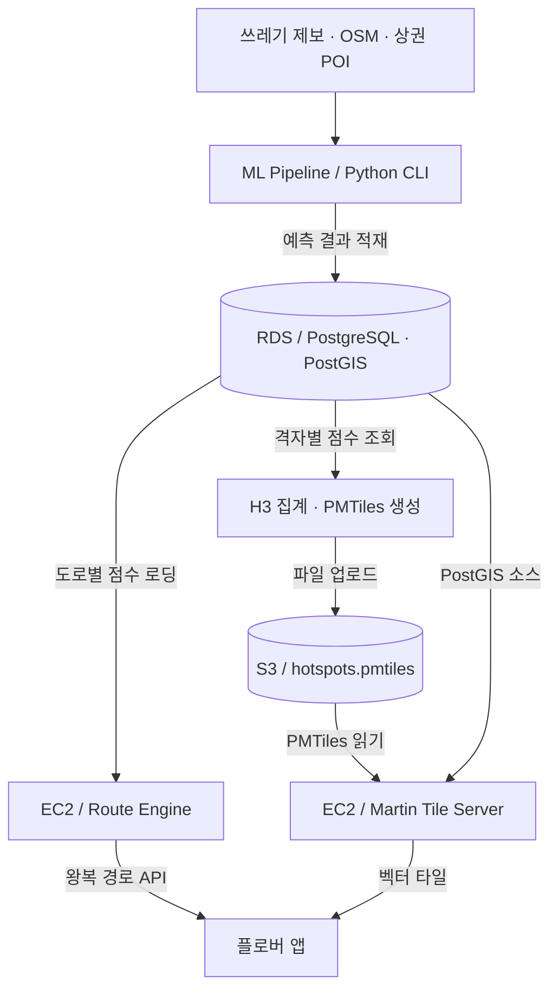

<p align="center">
  
</p>

<h1 align="center">Plover · 플로버</h1>

<p align="center">
  쓰레기 핫스팟 예측과 플로깅 경로 추천<br />
  <strong>공간 데이터에서 보행 경로까지, 예측 모델과 AWS 인프라를 연결한 서비스</strong>
</p>

<p align="center">
  <a href="https://apps.apple.com/kr/app/id6770872219">App Store</a> ·
  <a href="#시스템-구성">시스템 구성</a> ·
  <a href="#주요-설계">주요 설계</a> ·
  <a href="docs/SETUP.md">실행 가이드</a>
</p>

## 프로젝트 소개

플로깅을 시작할 때 **어디에 쓰레기가 있을지, 원하는 거리만큼 어떤 길을 걸으면 좋을지** 판단하기는 어렵습니다. 플로버는 쓰레기 제보와 주변 상권·도로 데이터를 활용해 쓰레기 핫스팟을 예측하고, 출발점으로 돌아오는 플로깅 경로를 추천합니다.

이 저장소는 플로버의 **머신러닝 파이프라인, 경로 추천 API, 지도 타일 서버**를 관리하는 모노레포입니다. 예측 결과를 PostGIS에 적재하고, 경로 탐색과 지도 제공에 사용하는 과정까지 구현했습니다.

| 항목 | 내용 |
| --- | --- |
| 개발 기간 | 2026.03 ~ 2026.07 |
| 개발자 | [김지환 · jihwan38](https://github.com/jihwan38) |
| 담당 범위 | AI 모델·데이터 처리, 경로 추천 API, 서비스별 AWS 인프라, CI/CD |
| 배포 구성 | 경로 추천·지도 타일 서버를 각각 EC2에 배포, RDS/PostGIS와 S3 연동 |

### 서비스 화면

<p align="center">
  
  
  
</p>

앱의 사용 흐름을 보여주는 [App Store 공개 이미지](https://apps.apple.com/kr/app/id6770872219)입니다. 이 저장소는 위 서비스의 예측·경로·지도 제공을 담당합니다.

## 시스템 구성



ML 파이프라인은 CLI로 실행하는 배치 작업입니다. 경로 추천 서버와 지도 타일 서버는 각각 별도의 EC2 인스턴스에서 실행하며, `scripts/init_route_db.sh`가 예측 격자와 OSM 도로를 연결하는 `osm_edge_trash_scores` 뷰를 구성합니다.

| 경로 | 역할 | 주요 구현 |
| --- | --- | --- |
| [`ml-pipeline/`](ml-pipeline) | 핫스팟 예측·지도 데이터 생성 | 수집, 공간 피처, PU-Learning, 추론, PostGIS 적재, PMTiles 생성 |
| [`route-engine/`](route-engine) | 왕복 경로 추천 API | 도로별 예측 점수 반영, 경로 후보 생성·선정 |
| [`tileserv/`](tileserv) | 지도 타일 제공 | Martin, PostGIS·S3 연결, 지도 확인용 뷰어 |
| [`scripts/`](scripts) | 데이터 준비·배치 실행 | OSM 전처리, 도로별 점수 집계, 지역별 파이프라인 실행 |
| [`.github/workflows/`](.github/workflows) | 서비스별 CI/CD | 경로 서버 PR 검증·배포, 타일 서버 배포 |

## 주요 설계

### 1. 모노레포 안에서 서비스별 실행·배포 분리

Python 모델 실행, JVM 기반 경로 탐색, 지도 타일 제공은 필요한 실행 환경과 변경 주기가 다릅니다. 관련 코드를 한 저장소에서 관리하면서, 서비스별 Docker 설정과 배포 워크플로를 분리했습니다.

| 워크플로 | 실행 조건 | 수행 작업 |
| --- | --- | --- |
| [Route CI](.github/workflows/route-ci.yml) | `main` 대상 PR에서 경로 서버 또는 해당 워크플로 변경 | JDK 21 환경에서 Gradle 빌드·테스트 |
| [Route CD](.github/workflows/route-cd.yml) | `main`에 경로 서버 또는 해당 워크플로 변경 반영 | 필수 Secrets 확인 → Docker 이미지 빌드·Docker Hub 등록 → EC2 배포 |
| [TileServ CD](.github/workflows/tileserv-cd.yml) | `main`에 타일 서버 또는 해당 워크플로 변경 반영 | 타일 서버 EC2에서 설정 갱신·컨테이너 재배포 |

경로 필터로 관련 서비스의 워크플로만 실행합니다. 경로 서버 이미지 빌드에는 BuildKit·GitHub Actions 캐시를 사용하며, 배포 환경의 DB 연결 정보는 GitHub Secrets에서 주입합니다.

경로 서버의 [Dockerfile](route-engine/Dockerfile)과 [Compose 설정](route-engine/docker-compose.yml)에는 다음을 구성했습니다.

- **실행 이미지 분리:** JDK 빌드 단계와 JRE 실행 단계를 구분한 멀티 스테이지 빌드.
- **실행 권한:** `spring` 일반 사용자로 애플리케이션 실행.
- **자원 설정:** 컨테이너 메모리 상한 `3.5G`, JVM `MaxRAMPercentage=65.0` 설정.
- **상태 확인:** `/actuator/health` 기반 헬스체크와 초기 구동 유예 시간 설정.
- **재시작·데이터 유지:** `unless-stopped` 정책과 지도·그래프 캐시용 호스트 볼륨 구성.

그래프 캐시의 기본 경로와 Compose 마운트 경로는 서로 달라, 실행 시 경로를 맞춰야 합니다. 구체적인 설정은 [실행 가이드](docs/SETUP.md#경로-추천-서버)에 정리했습니다.

### 2. 제보가 없는 지역의 불확실성을 반영한 예측

제보가 없는 장소를 깨끗한 장소라고 확정할 수는 없습니다. 제보 지점을 Positive, 나머지 격자를 Unlabeled로 두고 **PU-Learning 기반 XGBoost 앙상블**을 구현했습니다.

1. 기본 `10m` 격자를 생성하고 도로 주변 영역을 추립니다.
2. 편의점·음식점 등 POI의 `30 / 50 / 100m` 반경 내 개수와 도로 특성을 피처로 구성합니다.
3. 제보 위치에 격자 크기만큼 버퍼를 적용해 라벨을 매핑합니다.
4. 학습 데이터의 Unlabeled에서 서로 다른 표본을 추출해 여러 XGBoost 모델을 학습하고, 예측값을 평균합니다.

`geometry`, `grid_id`, `trash_count`, 정답 라벨 등은 학습 피처에서 제외합니다. 학습 지역과 추론 지역을 CLI 옵션으로 구분하며, 추론 결과는 `trash_score`와 공간 좌표를 포함한 GeoPackage로 저장합니다.

**코드:** [피처 생성](ml-pipeline/src/feature_engineering.py) · [데이터셋 구성](ml-pipeline/src/dataset_builder.py) · [PU 앙상블](ml-pipeline/src/models/pu_xgboost.py) · [학습·평가](ml-pipeline/src/model_trainer.py)

### 3. 예측 점수를 경로 탐색에 반영

예측 격자를 OSM 도로와 공간 조인해 도로별 쓰레기 점수를 집계합니다. 서버 시작 시 이 점수를 메모리에 로딩하고, GraphHopper의 도로 그래프를 생성할 때 `trash_prob` 속성으로 반영합니다.

- `PLOGGING`: 예측 점수가 높은 도로의 경로 탐색 우선순위를 높입니다.
- `COMFORT`: 예측 점수가 높은 도로의 우선순위를 낮춥니다.
- 보행 접근이 불가능한 도로와 `MOTORWAY`·`TRUNK` 도로는 기본 프로필에서 제외합니다.

왕복 경로는 서로 다른 seed로 **15회 생성을 시도**합니다. 성공한 후보를 경로 가중치 대비 거리로 정렬한 뒤, 목표 거리와 경로 방향의 다양성을 고려해 **최대 3개**를 선정합니다. 후보가 부족하면 거리·방향 조건을 순차적으로 완화합니다.

**코드:** [도로별 점수 준비](scripts/init_route_db.sh) · [점수 캐싱](route-engine/src/main/java/com/plobber/routing/repository/HotspotRepositoryImpl.java) · [그래프 속성 확장](route-engine/src/main/java/com/plobber/routing/graphhopper/PloggingTagParser.java) · [모드별 가중치](route-engine/src/main/java/com/plobber/routing/graphhopper/CustomModelBuilder.java) · [경로 선정](route-engine/src/main/java/com/plobber/routing/service/RouteService.java)

### 4. 공간 데이터 처리와 지도 제공 방식 분리

세밀한 예측 격자를 처리하는 작업과 지도를 탐색할 때 필요한 데이터 제공 방식을 구분했습니다.

- **분할 처리:** 피처 생성·추론은 최대 300만 행 단위, PostGIS 적재는 10만 행 단위로 처리합니다.
- **지도용 집계:** PostGIS 결과를 20만 행씩 읽어 H3 셀별 평균·최댓값을 집계합니다. 집계 상태는 H3 셀 단위로 유지합니다.
- **줌별 해상도:** H3 해상도 `7 / 9 / 11`을 각각 지도 줌 `4–11 / 12–15 / 16–17`에 대응시킵니다.
- **정적 타일 생성:** Tippecanoe로 타일을 만들고 PMTiles로 변환한 뒤 S3에 업로드합니다. Martin이 이를 벡터 타일로 제공합니다.

**코드:** [분할 추론](ml-pipeline/src/predictor.py) · [PostGIS 적재](ml-pipeline/src/db_pusher.py) · [H3 집계](ml-pipeline/src/postprocess_h3.py) · [타일 생성·업로드](ml-pipeline/src/tile_builder.py) · [Martin 구성](tileserv/docker-compose.yml)

## 기술 스택

| 영역 | 기술 |
| --- | --- |
| 경로 추천 API | Java 21, Spring Boot 4.0.6, GraphHopper 11.0 |
| 모델·공간 처리 | Python 3.12+, XGBoost, scikit-learn, GeoPandas, OSMnx, H3 |
| 데이터 저장 | PostgreSQL/PostGIS, GeoPackage, AWS S3 |
| 지도 제공 | Martin 1.9.1, Tippecanoe, PMTiles |
| 인프라·자동화 | AWS EC2·RDS, Docker Compose, GitHub Actions |
| 개발·테스트 | uv, Gradle Wrapper, pytest, JUnit 5, Mockito |

## 경로 API

```http
GET /api/v1/route?lat=35.146&lon=126.923&distance=5000&mode=PLOGGING
```

| 파라미터 | 설명 |
| --- | --- |
| `lat`, `lon` | 출발점 위도·경도. 준비한 도로망 범위 내 좌표 사용 |
| `distance` | 목표 왕복 거리(m). 기본 `5000`, 허용 범위 `500–30000` |
| `mode` | `PLOGGING` 또는 `COMFORT`. 기본 `PLOGGING` |

응답은 경로 객체의 배열입니다. 각 객체는 거리 `distanceMeter`, 예상 소요 시간 `timeMillis`, 정밀도 5자리의 encoded polyline `encodedPath`, 추천 점수 `ploggingScore`를 포함합니다.

`ploggingScore`는 후보 비교를 위한 휴리스틱 점수이며, 실제 쓰레기 수거량이나 모델 정확도를 뜻하지 않습니다.

## 실행 및 테스트

먼저 Python CLI를 확인할 수 있습니다.

```bash
git clone https://github.com/JNU-econovation/plover-route.git
cd plover-route/ml-pipeline
uv sync --frozen
uv run --frozen python main.py --help
```

학습·추론에는 POI 원본 CSV와 학습 데이터가, 경로 추천에는 OSM PBF와 준비된 PostGIS 데이터가 필요합니다. 원본 데이터·학습 모델·환경변수는 저장소에 포함되어 있지 않습니다.

**[실행 가이드 →](docs/SETUP.md)** 에서 환경변수, 데이터 준비 순서, API 실행, 타일 생성, 테스트 명령과 현재 확인된 주의 사항을 확인할 수 있습니다.

## 구현 범위와 다음 과제

- **경로 추천:** 현재 API는 도로 가중치를 반영한 왕복 경로 생성을 사용합니다. 저장소의 `HotspotSelector`·jsprit 기반 경유지 선택 코드는 현재 요청 처리에서 호출하지 않습니다.
- **예측 결과 갱신:** 도로 점수와 그래프는 시작·생성 시 반영됩니다. 새 예측 결과를 경로에 적용하려면 도로별 집계와 그래프 캐시를 함께 갱신해야 합니다.
- **모델 검증:** 현재 학습 코드는 라벨 비율을 유지한 무작위 holdout을 사용합니다. 지역 간 일반화 성능은 지역을 분리한 평가로 추가 검증할 과제입니다.

## 데이터 및 문의

도로망은 [OpenStreetMap](https://www.openstreetmap.org/copyright), 제보 데이터 수집은 [동구라미](https://donggurami.kr/) API를 사용합니다. POI CSV는 실행 환경에서 별도로 준비합니다. 데이터 재사용 시 각 제공처의 이용 조건을 확인해 주세요.

구현 관련 문의는 [GitHub Issues](https://github.com/JNU-econovation/plover-route/issues)로 남겨 주세요.
